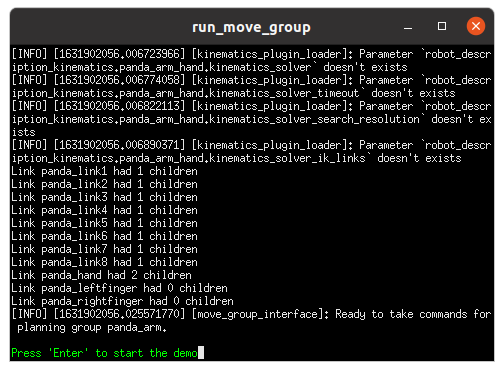

# MoveIt2 Docker Image

The MoveIt2 Docker image uses the Space ROS docker image (*openrobotics/spaceros:latest*) as its base image. The MoveIt2 Dockerfile installs all of the prerequisite system dependencies to build MoveIt2 and then pulls and builds the latest MoveIt2 source code.

## Building the MoveIt2 Image

To build the docker image, run:

```
$ ./build-image.sh
```

The build process will take about 30 minutes, depending on the host computer.

## Running the MoveIt2 Docker Image in a Container

After building the image, you can see the newly-built image by running:

```
$ docker image list
```

The output will look something like this:

```
REPOSITORY              TAG                        IMAGE ID       CREATED        SIZE
openrobotics/moveit2    latest                     6edb2edc9643   10 hours ago   15.5GB
openrobotics/spaceros   latest                     629b13cf7b74   12 hours ago   7.8GB
nvidia/cudagl           11.4.1-devel-ubuntu20.04   336416dfcbba   1 week ago     5.35GB
```

The new image is named **openrobotics/moveit2:latest**.

To run the resulting image in a container, run:

```
$ docker run -it --gpus all --net=host -e DISPLAY -v /tmp/.X11-unix openrobotics/moveit2
```

If the previous command fails as follows, 

```
docker: Error response from daemon: could not select device driver "" with capabilities: [[gpu]].
ERRO[0000] error waiting for container: context canceled 
```

your GPU may not be enabled in the Docker container and you can try again, omiting '--gpus all', as follows:

```
$ docker run -it --net=host -e DISPLAY -v /tmp/.X11-unix openrobotics/moveit2
```

Upon startup, the container automatically runs the moveit2_entrypoint.sh script, which sources the MoveIt2 and Space ROS environment files. You'll now be running inside the container and should see a prompt similar to this:

```
root@8e73b41a4e16:/usr/local/src/moveit2_ws# 
```

For more information on accessing host resources, such as GPUs from a Docker container, see the [Docker documentation](https://docs.docker.com/config/containers/resource_constraints/).

## Configuring the Container for GUI Applications

NOTE: Information in this section about running GUI applications from Docker containers was derived from [this page](https://www.geeksforgeeks.org/running-gui-applications-on-docker-in-linux/).

To run MoveIt2 demonstrations and tutorials, GUI applications must be allowed to run from the Docker container. 

First, from a host terminal, run the following command to allow the root user on the local machine to connect to X windows display. See [this link](https://stackoverflow.com/questions/43015536/xhost-command-for-docker-gui-apps-eclipse) for more information.

```
$ xhost +local:root
```

Next run the following command to show the list of authorized X applications:

```
$ xauth list
```

The output will look something like this:

```
bluesalley/unix:  MIT-MAGIC-COOKIE-1  86a28c6ed13e41441092b7a97080139f
#ffff#626c756573616c6c6579#:  MIT-MAGIC-COOKIE-1  86a28c6ed13e41441092b7a97080139f
```

Then, based on the first line of the above output, compose a similar command of the following form to run in the container:

```
xauth add <hostname>/unix:0  MIT-MAGIC-COOKIE-1  <cookie-value>
```

For example, given the specific output above, the command would be (run in the container):

```
xauth add bluesalley/unix:0  MIT-MAGIC-COOKIE-1  86a28c6ed13e41441092b7a97080139f
```

Now, you should be able to run a GUI application from the container. For example, running 'firefox', you should see the firefox window pop up on the desktop:


You can also test the graphics output by running 'glmark2'. A window like the following should appear:


NOTE: The *xauth add* command will have to be run each time a MoveIt2 container is started.

Once GUIs and graphics are verified to be working from the container, you can move on to the next step, running the MoveIt2 MoveGroup demo.

## Running Moveit2's MoveGroup Demo

From a container that has been configured and verified to run GUI and graphics apps, run the following command:

```
ros2 launch run_move_group run_move_group.launch.py
```

You will see a lot of console output and the rviz2 window will appear:


Now, from a second host terminal, either connect to the existing container, using 'docker container list' and 'docker exec', similar to the following:

```
$ docker container list
CONTAINER ID   IMAGE                  COMMAND                  CREATED          STATUS          PORTS     NAMES
5c08ddc48d79   openrobotics/moveit2   \"/moveit2_entrypoint…"   15 minutes ago   Up 15 minutes             angry_ptolemy
```
```
$ docker exec -it 5c08ddc48d79 /bin/bash /moveit2_entrypoint.sh
```

or launch and configure a new container per the above instructions for configuring a running container for GUI applications.

In either case, from a container that has been configured and verified to run GUI and graphics apps, you can now run the second part of the demo:

```
ros2 launch run_move_group run_move_group_interface.launch.py
```
This brings up an xterm, like this:



You can now press ENTER multiple times to step through the demo.

## Running Unit Tests for the MoveGroup Demo

To run the unit tests for the MoveGroup demo, run the following command from the container command line at the top of the MoveIt2 workspace (/usr/local/src/moveit2_ws/):

```
colcon test --packages-select moveit_ros_move_group
```

The test results will be in the test output directory, /usr/local/src/moveit2_ws/build/moveit_ros_move_group/test_results/.

## Open Issues

* With the latest MoveIt2 source, compiled against the latest Space ROS source code, there is currently a compile-time error in realtime_server_goal_handle.h. There is a patch installed (patch-1.diff) in the Dockerfile to work around this.

* There are two versions of libcurl installed on the system, one installed along with the curl utility (installed in the base Space ROS image) and another that comes along with other installed libraries. There are warnings output when running utilities, such as cmake, that load libcurl. However, this seems not to affect the build process.
