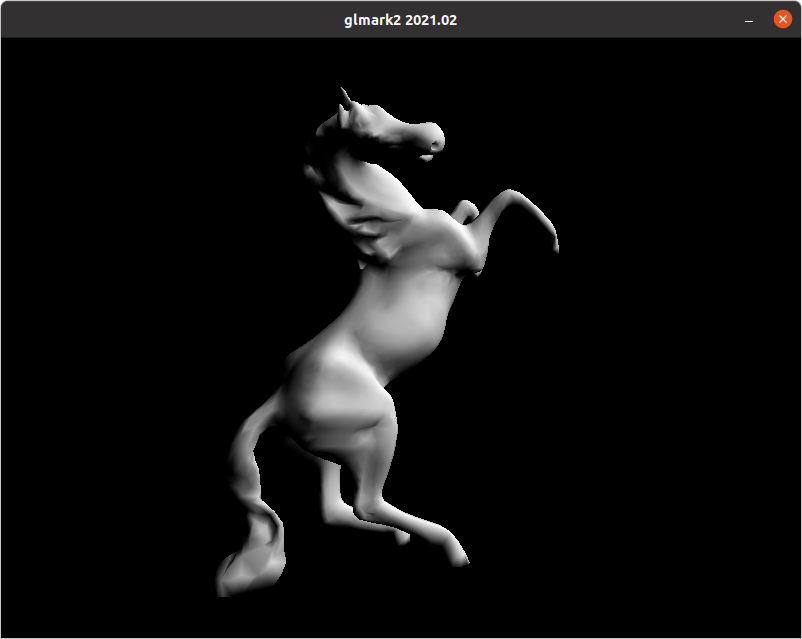

# MoveIt2 Docker Image

The MoveIt2 Docker image uses the Space ROS docker image (*openrobotics/spaceros:latest*) as its base image. The MoveIt2 Dockerfile installs all of the prerequisite system dependencies to build MoveIt2 and then pulls and builds the latest MoveIt2 source code.

## Building the MoveIt2 Image

To build the docker image, run:

```
$ ./build.sh
```

The build process will take about 30 minutes, depending on the host computer.

## Running the MoveIt2 Docker Image in a Container

After building the image, you can see the newly-built image by running:

```
$ docker image list
```

The output will look something like this:

```
REPOSITORY              TAG                        IMAGE ID       CREATED        SIZE
openrobotics/moveit2    latest                     6edb2edc9643   10 hours ago   15.5GB
openrobotics/spaceros   latest                     629b13cf7b74   12 hours ago   7.8GB
nvidia/cudagl           11.4.1-devel-ubuntu20.04   336416dfcbba   1 week ago     5.35GB
```

The new image is named **openrobotics/moveit2:latest**.

To run the resulting image in a container, run:

```
$ docker run -it --gpus all --net=host -e DISPLAY -v /tmp/.X11-unix openrobotics/moveit2
```

If the previous command fails as follows, 

```
docker: Error response from daemon: could not select device driver "" with capabilities: [[gpu]].
ERRO[0000] error waiting for container: context canceled 
```

your GPU may not be enabled in the Docker container and you can try again, omiting '--gpus all', as follows:

```
$ docker run -it --net=host -e DISPLAY -v /tmp/.X11-unix openrobotics/moveit2
```

Upon startup, the container automatically runs the moveit2_entrypoint.sh script, which sources the MoveIt2 and Space ROS environment files. You'll now be running inside the container and should see a prompt similar to this:

```
root@8e73b41a4e16:/root/src/moveit2_ws# 
```

For more information on accessing host resources, such as GPUs from a Docker container, see the [Docker documentation](https://docs.docker.com/config/containers/resource_constraints/).

## Configuring the Container for GUI Applications

NOTE: Information in this section about running GUI applications from Docker containers was derived from [this page](https://www.geeksforgeeks.org/running-gui-applications-on-docker-in-linux/).

To run MoveIt2 demonstrations and tutorials, GUI applications must be allowed to run from the Docker container. 

First, from a host terminal, run the following command to allow the root user on the local machine to connect to X windows display. See [this link](https://stackoverflow.com/questions/43015536/xhost-command-for-docker-gui-apps-eclipse) for more information.

```
$ xhost +local:root
```

Next run the following command to show the list of authorized X applications:

```
$ xauth list
```

The output will look something like this:

```
bluesalley/unix:  MIT-MAGIC-COOKIE-1  86a28c6ed13e41441092b7a97080139f
#ffff#626c756573616c6c6579#:  MIT-MAGIC-COOKIE-1  86a28c6ed13e41441092b7a97080139f
```

Then, based on the first line of the above output, compose a similar command of the following form to run in the container:

```
xauth add <hostname>/unix:0  MIT-MAGIC-COOKIE-1  <cookie-value>
```

For example, given the specific output above, the command would be (run in the container):

```
xauth add bluesalley/unix:0  MIT-MAGIC-COOKIE-1  86a28c6ed13e41441092b7a97080139f
```

Now, you should be able to run a GUI application from the container. For example, running 'firefox', you should see the firefox window pop up on the desktop:


You can also test the graphics output by running 'glmark2'. A window like the following should appear:



NOTE: The *xauth add* command will have to be run each time a MoveIt2 container is started.

Once GUIs and graphics are verified to be working from the container, you can move on to the next step: [building and running MoveIt2 Tutorials](../moveit2_tutorials/README.md).
