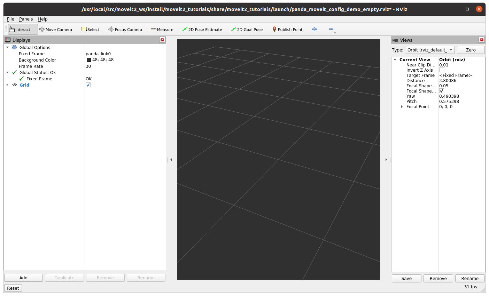

# MoveIt2 Tutorials Docker Image

The MoveIt2 Tutorials Docker image uses the MoveIt2 image (*openrobotics/moveit2:latest*) as its base image. The MoveIt2 Tutorials Dockerfile downloads the tutorials source code into the MoveIt2 workspace and rebuilds the MoveIt2 source code, which now includes the tutorials.

## Building the MoveIt2 Image

To build the docker image, run:

```
$ ./build.sh
```

The build process will take about 10 minutes, depending on the host computer.

## Running the MoveIt2 Tutorials Docker Image in a Container

After building the image, you can see the newly-built image by running:

```
$ docker image list
```

The output will look something like this:

```
REPOSITORY              TAG                        IMAGE ID       CREATED        SIZE
openrobotics/moveit2_tutorials   latest            622fe9ec7ed6   11 minutes ago   16GB
openrobotics/moveit2    latest                     6edb2edc9643   10 hours ago   15.5GB
openrobotics/spaceros   latest                     629b13cf7b74   12 hours ago   7.8GB
nvidia/cudagl           11.4.1-devel-ubuntu20.04   336416dfcbba   1 week ago     5.35GB
```

The new image is named **openrobotics/moveit2_tutorials:latest**.

There is a run.sh script provided for convenience that will run the image in a container.

```
$ ./run.sh
```

Upon startup, the container automatically runs the moveit2_entrypoint.sh script, which sources the MoveIt2 and Space ROS environment files. You'll now be running inside the container and should see a prompt similar to this:

```
spaceros-user@8e73b41a4e16:~/src/moveit2_tutorials#
```

Run the following command to launch the MoveIt2 tutorials demo launch file:

```
ros2 launch moveit2_tutorials demo.launch.py rviz_tutorial:=true
```

You should see lots of console output and the rviz2 window appear:



You can now following the [MoveIt2 Tutorial documentation](https://moveit.picknik.ai/galactic/doc/tutorials/quickstart_in_rviz/quickstart_in_rviz_tutorial.html).

## Running the MoveIt2 Move Group C++ Interface Demo

To run the Move Group C++ Interface Demo, execute the following command:

```
ros2 launch moveit2_tutorials move_group.launch.py
```

Then, you can follow the [Move Group C++ Interface Demo documentation](https://moveit.picknik.ai/galactic/doc/examples/move_group_interface/move_group_interface_tutorial.html).
